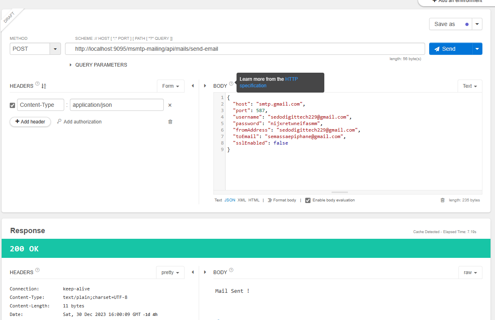

# SPRING MULTIPLE SMTP MAIL SERVER

Ce projet a été créé pour gérer l'envoie des mails avec plusieurs serveurs smtp. Vous avez deux choix : 

* Soit vous demandez à Spring de charger les configs de ses serveurs mis au préalabre au niveau du application.properties dans le context (vous trouverez une config avec le serveur de Google déjà configuré. Vous pouvez ajouter les configs de votre second serveur smtp et ainsi de suite jusqu'à l'infini)
* Soit vous passez les configs de votre serveur via une api dont l'url est la suivante : http://localhost:9095/msmtp-mailing/api/mails/send-email

#### Vous pouvez cloner le projet pour le modifier ou customiser selon votre contexte et utilisation.

# J'accepte aussi les contributeurs pour donner encore plus de fonctionnalités dans le sens de la flexibilité de l'envoie en masse des mails avec des fichiers

